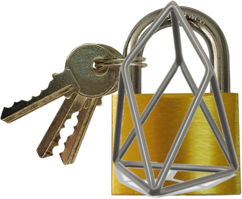

# BlockSec

Overview about projects created during the EOS Hackathon in London on 22/23 September 2018

## Brief

The goal of this project is to protect users from the fraudulent sites (such as phishing or spam websites). This works by checking the site certificate againt blacklisted on the EOS blockchain.

### Usage of the blockchain

The list of the public certificates is created and voted by the users using a voting widget, which is stored and managed by EOS blockchain.

Using this method, the blacklisting process is flexible by being decentralized, in comparison to long hardcoded list which are quickly get outdated and difficult to maintain.

### Innovation & Creativity

Comparing to other projects, BlockSec is protecting the content based on the associated public SSL certificate.

For comparison, some existing projects are blocking the content based on the hardcoded list of domains, which makes then not efficient by creating a huge list of domains which are very difficult to maintain. Secondly, such hardcoded lists can be easily workarounded by creating different patterns or domains right after it is blocked.

Nowadays it is very easy to get the SSL certificate issued by trusted authority. However, such issued certificates does not validate contents of the site (despite having a green padlock icon), which prove the point that the certificates were NEVER meant for that! In other words, a verified certificate can only verify that you are connecting to the scam-site, and it is up to user to decide whether he trust it or not.

By creating a smart contract which can warn users about the scam-sites based on actual public certificates which were black listed, it helps users to protect from scammers and phishing content.

### Impact

The app can potentially handle over a million websites where each certificate can be verified by trusted users. 

### Scalibility

The app is storing and managing the certificates by using EOS blockchain, making it flexible and scalable.

By implementing it using EOS blockchain, a network capable of processing millions of transactions per second, our app can be highly scalable.

### Business model

Our business model is not about earning the money, but helping people not losing them.

However, there are many ways where both parties can benefit. The scam market is a very huge and serious matter. Every day hundred of people get scammed around the world for unbelievable large amount of money, and due to lack of awareness and knowledge, they don't know how to protect from the criminals, so their money get lost forever.

However not many people are aware that most of the lost funds sent to scammers can be actually recovered by a law firm specialising in litigation. They can help with diligence report on target company, legal documentation, out-of court settlement or any other statutory legislation applicable in your own country. They can also give you an advice whether you may be entitled to claim a chargeback from your bank.

So by posting educational resources and selling the legal adverts on our warning pages (such as banners of trusted law firms dealing with scammers professionally), both parties can hugely benefit.

### Use cases

This app protects users from entering suspicious websites such as phishing, scam or infected with viruses, despite having valid certificates, as valid issued certificate does not guarantee its content.

Few examples:

- [Fake Telegram ICO fundraising](https://ico-telegram.org/#features)
- [This spoof Apple site illustrates the sophistication of today’s phishing attacks](https://9to5mac.com/2017/04/20/how-to-spot-a-phishing-attempt-fake-apple-site/)

## Installation

The protection can be enabled on any computer, tablet or a smart phone supporting a web browser, by installing an extension.

Steps to install extension:
1. Download the project.
2. Go to `chrome://extensions` (Chrome, Firefox or Opera).
3. Select _Developer mode_, and _Load unpacked extension..._
4. Choose `extension/Chrome` folder of that project.
